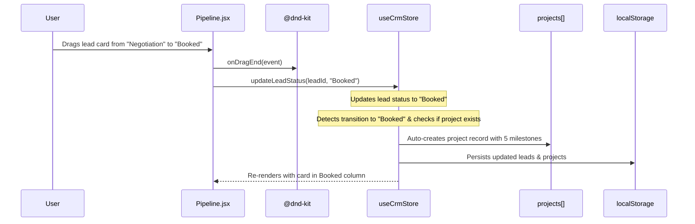
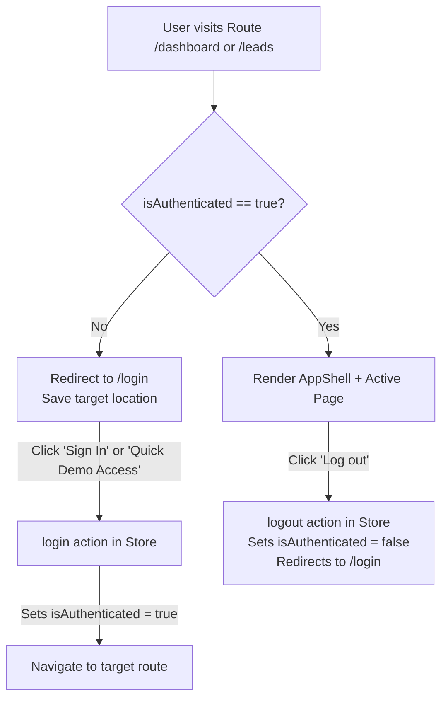

# LensFlow CRM — Data Flow Architecture

This document describes the complete data architecture, state lifecycle, automated business logic, and page-by-page data flow of **LensFlow CRM**.

---

## 🏗️ 1. Architecture Overview

```mermaid
flowchart TD
    subgraph Data & Persistence Layer
        MOCK[src/data/mockData.js\nInitial Seed Data] -->|Hydrates on First Run| STORE[Zustand Global Store\nsrc/store/useCrmStore.js]
        STORE <-->|Auto Sync / Persist Middleware| LS[(Browser localStorage\nKey: 'lensflow_crm_store')]
    end

    subgraph User Actions & Store Triggers
        A1[Add Lead Modal] -->|addLead| STORE
        A2[Pipeline Kanban Drag & Drop] -->|updateLeadStatus| STORE
        A3[Project Milestone Checklist] -->|updateProjectMilestone| STORE
        A4[Follow-ups Schedule / Reschedule] -->|setNextFollowUp| STORE
        A5[Global Top Search Input] -->|setSearchQuery| STORE
        A6[Auth Sign In / Sign Out] -->|login / logout| STORE
    end

    subgraph Core Automation Engine
        STORE -->|When status changes to 'Booked'| AUTO_PROJ[Auto-Creates Project Record\nwith 5 sequential milestones\nand contract amounts]
        AUTO_PROJ --> STORE
    end

    subgraph Reactive Pages & Consumers
        STORE --> P1[Dashboard Page\nLive Stats, Donut Chart, Pipeline Bars]
        STORE --> P2[Leads Table Page\nMulti-filter, Search, Pagination]
        STORE --> P3[Pipeline Kanban Board\n@dnd-kit 5-stage Columns]
        STORE --> P4[Projects Page\nMilestone Tracker & Payments]
        STORE --> P5[Clients Directory\nConverted Booked Leads]
        STORE --> P6[Follow-ups Queue\nOverdue, Today, Upcoming Tabs]
        STORE --> P7[Calendar Page\nShoot Dates & Follow-up Reminders]
        STORE --> P8[Analytics Page\nFunnel, Monthly Bookings, Sources]
        STORE --> P9[Settings Page\nProfile & Mock Data Reset]
    end
```



---

## 📦 2. Data Models & State Schema

The entire application state is stored inside **Zustand** and persisted under the `lensflow_crm_store` key in `localStorage`.

### 2.1 Lead Entity
```javascript
{
  id: "lead-001",
  name: "Rahul Sharma",
  source: "Instagram", // Instagram | WhatsApp | Facebook | Website | Referral
  handle: "@rahulsharma",
  phone: "+91 98200 11223",
  email: "rahul@email.com",
  event: "Wedding",    // Wedding | Pre-Wedding | Engagement | Birthday | Maternity | Corporate
  eventDate: "2026-12-24",
  location: "Mumbai",
  guests: 350,
  requirements: ["Photography", "Videography", "Cinematic Film", "Album", "Reels"],
  budget: 150000,
  quotation: 165000,
  advance: 50000,
  status: "Quotation", // New | Contacted | Quotation | Negotiation | Booked | Follow-up | Lost
  nextFollowUp: "2026-09-18",
  followUpTime: "2:00 PM",
  activity: [
    { date: "2026-09-13", note: "Instagram enquiry" },
    { date: "2026-09-15", note: "Called client" },
    { date: "2026-09-16", note: "Quotation sent" }
  ],
  createdAt: "2026-09-13"
}
```

### 2.2 Project Entity (Auto-Generated from Bookings)
```javascript
{
  id: "proj-001",
  leadId: "lead-004",
  name: "Neha Shah",
  event: "Wedding Photography",
  eventDate: "2026-12-05",
  location: "Pune",
  milestones: {
    bookingConfirmed: true,
    shootCompleted: false,
    editing: false,
    album: false,
    finalDelivery: false
  },
  total: 210000,
  paid: 70000
}
```

---

## ⚡ 3. Key Data Flow Lifecycles

### 3.1 Lead Acquisition ➔ Pipeline
1. The user clicks **`+ Add Lead`** (from Leads, Dashboard, or Pipeline).
2. The form dispatches `addLead(leadData)` to `useCrmStore`.
3. The store generates an ID (`lead-017`), sets initial status (e.g. `New`), and prepends it to `leads`.
4. The change automatically propagates to:
   - **Dashboard**: Total Leads and New Leads counts increment immediately.
   - **Leads Table**: New row appears on Page 1.
   - **Pipeline**: Card appears in the **New** column.
   - **Analytics**: Donut chart and conversion funnel update in real time.

---

### 3.2 Kanban Drag & Drop ➔ Project Auto-Creation


---

### 3.3 Project Milestone Progression
1. When viewing the **Projects** page, each row displays a dynamic progress bar calculated as:
   $$\text{Progress \%} = \left(\frac{\text{Completed Milestones}}{5}\right) \times 100$$
2. Clicking **"View"** opens the Project Modal.
3. Checking/unchecking a milestone (e.g. `Shoot Completed` or `Album Design`) calls `updateProjectMilestone(projectId, key, isDone)`.
4. The project's overall status pill dynamically shifts:
   - `Booking Confirmed` ➔ `Shoot Scheduled` (Blue)
   - `Shoot Completed` ➔ `Editing` (Amber)
   - `Editing` ➔ `Album` (Purple)
   - `Album` ➔ `Delivery` (Cyan)
   - `Final Delivery` ➔ `Completed` (Emerald)

---

### 3.4 Clients Directory Aggregation
- The **Clients** page does not store separate client entities.
- It dynamically filters `leads.filter(l => l.status === "Booked")`.
- For each booked lead, it queries `projects.find(p => p.leadId === l.id)` to compute:
  - Total Contract Value (`project.total`)
  - Total Advance Received (`project.paid`)
  - Direct navigation link to the project tracking workflow.

---

### 3.5 Follow-ups Queue & Calendar Engine
- **Follow-ups Page**:
  - Compares `lead.nextFollowUp` against today's date ($YYYY-MM-DD$):
    - $\text{Date} < \text{Today} \implies$ **Overdue** tab
    - $\text{Date} == \text{Today} \implies$ **Today** tab
    - $\text{Date} > \text{Today} \implies$ **Upcoming** tab
    - $\text{Status} == \text{Booked} \lor \text{No Date} \implies$ **Completed** tab
- **Calendar Page**:
  - Aggregates two types of events onto the 7-column month grid:
    1. 🟠 **Follow-up Reminders**: Keyed by `lead.nextFollowUp`.
    2. 🟣 **Shoot Days**: Keyed by `lead.eventDate`.
  - Clicking any date cell opens a popup listing all shoots and follow-ups for that day.

---

## 🔒 4. Route Guarding & Authentication Flow



---

## 📊 5. Summary of Store Methods

| Action | Parameters | Description |
|---|---|---|
| `login()` | — | Sets `isAuthenticated: true` |
| `logout()` | — | Sets `isAuthenticated: false` and redirects to `/login` |
| `setSearchQuery(query)` | `query: string` | Updates global search state used across header & tables |
| `updateLeadStatus(id, newStatus)` | `id: string, newStatus: string` | Updates lead status; auto-creates project record if set to `"Booked"` |
| `addLead(leadData)` | `leadData: object` | Adds a new enquiry to `leads` with generated ID |
| `addActivity(leadId, note)` | `leadId: string, note: string` | Appends a timestamped log to the lead's `activity` array |
| `setNextFollowUp(leadId, date)` | `leadId: string, date: string` | Updates the scheduled follow-up reminder date |
| `updateProjectMilestone(projectId, key, isDone)` | `projectId, key, isDone` | Toggles milestone state and updates progress calculation |
| `updateProjectPayment(projectId, paid)` | `projectId, paid: number` | Updates paid advance amount for a project |
